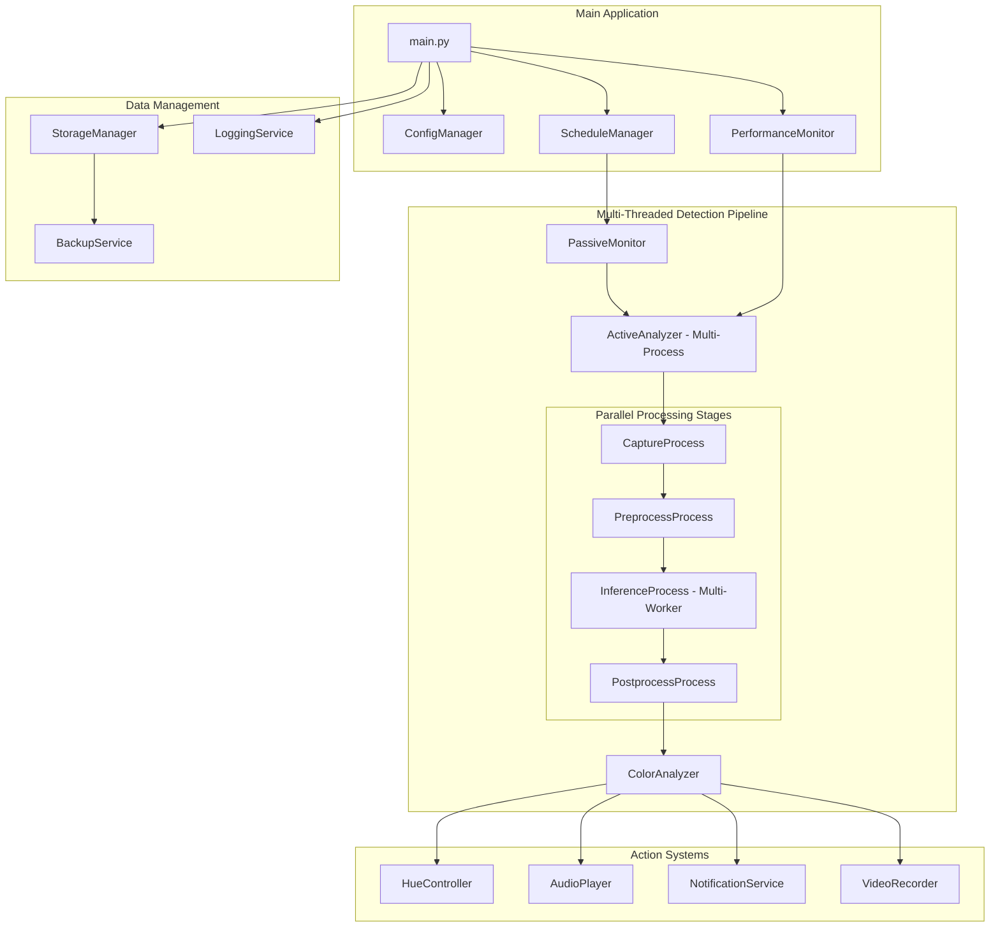
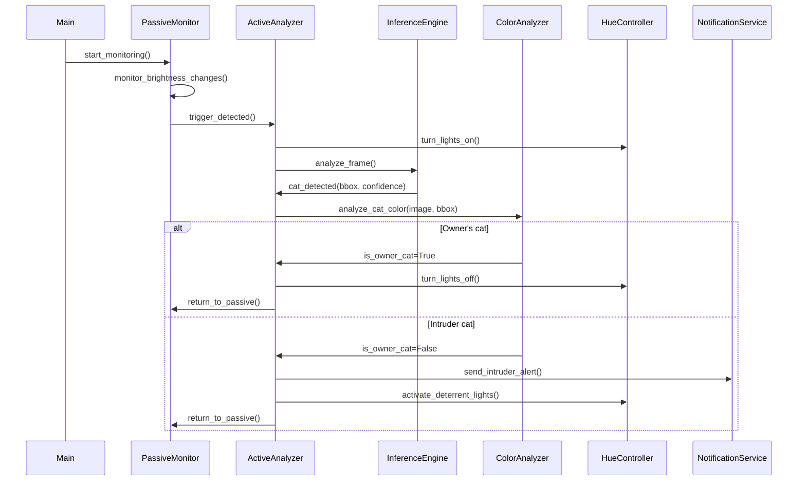

# Design Document

## Overview

TheCatBouncer is designed as a modular, event-driven system that efficiently monitors for cat intrusions using a two-phase approach. The system follows clean architecture principles with clear separation of concerns, dependency injection, and comprehensive error handling. All components are designed to be testable, maintainable, and follow Python best practices.

## Architecture

### High-Level Architecture



### Component Interaction Flow



## Components and Interfaces

### 1. Configuration Management

**ConfigManager Class**
- Loads and validates configuration from config.ini
- Provides type-safe access to configuration values
- Handles default values and validation
- Supports environment variable overrides for sensitive data

```python
class ConfigManager:
    def __init__(self, config_path: Path)
    def get_camera_config() -> CameraConfig
    def get_detection_config() -> DetectionConfig
    def get_hue_config() -> HueConfig
    def validate_config() -> List[ValidationError]
```

### 2. Passive Monitoring System

**PassiveMonitor Class**
- Monitors low-resolution video stream for brightness changes
- Implements state machine for darkness → brightness detection
- Configurable brightness thresholds and trigger conditions
- Minimal resource usage design

```python
class PassiveMonitor:
    def __init__(self, camera_config: CameraConfig, trigger_config: TriggerConfig)
    def start_monitoring() -> None
    def stop_monitoring() -> None
    def set_brightness_strategy(strategy: BrightnessStrategy) -> None
```

### 3. High-Performance Multi-Threaded Active Analysis Pipeline

**ActiveAnalyzer Class**
- Manages high-throughput multi-process video processing pipeline
- Implements separate processes for capture, preprocessing, inference, and postprocessing
- Coordinates between inference engine and color analysis with maximum parallelism
- Handles timeouts and error recovery with performance monitoring
- Dynamically adjusts worker thread count based on hardware capabilities

```python
class ActiveAnalyzer:
    def __init__(self, inference_engine: InferenceEngine, color_analyzer: ColorAnalyzer, worker_config: WorkerConfig)
    def analyze_stream(timeout_seconds: int) -> AnalysisResult
    def start_pipeline() -> None
    def stop_pipeline() -> None
    def get_performance_metrics() -> PerformanceMetrics
    def optimize_worker_count() -> None
```

### 4. AI Inference System

**InferenceEngine Interface**
- Abstract base class for different AI backends with multi-threading support
- Supports ONNX, OpenVINO, PyTorch, SafeTensors, CoreML with automatic format selection
- Smart hardware-optimized format selection based on detected hardware
- Multi-worker inference processing for maximum throughput
- Cross-platform GPU support with format-specific optimizations
- Model format conversion utilities for optimal performance
- Real-time performance monitoring and logging with hardware utilization metrics

```python
class InferenceEngine(ABC):
    @abstractmethod
    def predict(self, image: np.ndarray) -> List[Detection]
    @abstractmethod
    def get_class_names() -> List[str]
    
class InferenceFactory:
    @staticmethod
    def create_engine(config: InferenceConfig) -> InferenceEngine
    @staticmethod
    def detect_best_hardware() -> Tuple[str, str]  # (hardware_type, optimal_format)
    @staticmethod
    def get_available_backends() -> List[str]
    @staticmethod
    def get_optimal_format(hardware_type: str, os_type: str) -> str
    @staticmethod
    def validate_model_format(model_path: Path, expected_format: str) -> bool
```

### 5. Color Analysis System

**ColorAnalyzer Class**
- Supports multiple analysis methods (HSV, LLM)
- Configurable color ranges and thresholds
- Integration with local Ollama for LLM-based analysis
- Fallback mechanisms for reliability

```python
class ColorAnalyzer:
    def __init__(self, method: str, config: ColorConfig)
    def analyze_cat_color(image: np.ndarray, bbox: BoundingBox) -> bool
    def set_analysis_method(method: AnalysisMethod) -> None
```

### 6. Smart Home Integration

**HueController Class**
- Philips Hue bridge communication
- Light state management and error handling
- Configurable lighting scenes and patterns
- Graceful degradation when unavailable

```python
class HueController:
    def __init__(self, bridge_ip: str, app_key: str)
    def turn_lights_on(light_ids: List[str], **kwargs) -> bool
    def turn_lights_off(light_ids: List[str]) -> bool
    def activate_deterrent_pattern(light_ids: List[str]) -> bool
```

### 7. Audio System

**AudioPlayer Class**
- Cross-platform audio playback
- Support for multiple audio formats (.wav, .mp3)
- Random sound selection for variety
- Volume control and duration management

```python
class AudioPlayer:
    def __init__(self, sound_directory: Path)
    def play_random_sound() -> bool
    def stop_playback() -> None
    def set_volume(level: float) -> None
```

### 8. Notification System

**NotificationService Class**
- Multi-channel notification support (Email, Telegram)
- Template-based message formatting
- Image attachment handling
- Retry logic and error handling

```python
class NotificationService:
    def __init__(self, config: NotificationConfig)
    def send_intruder_alert(message: str, image_path: Path) -> bool
    def add_notification_channel(channel: NotificationChannel) -> None
```

### 9. Data Management

**StorageManager Class**
- Organized file storage with date-based folders
- Automatic cleanup based on age and disk space
- Metadata storage for detections
- Performance monitoring data

```python
class StorageManager:
    def __init__(self, base_path: Path, config: StorageConfig)
    def save_detection(image: np.ndarray, metadata: dict) -> Path
    def cleanup_old_files() -> None
    def check_disk_space() -> float
```

**BackupService Class**
- Cross-platform backup implementation (Windows: robocopy, macOS/Linux: rsync)
- SMB share support for Windows, SSH/SCP for Unix-like systems
- Incremental backup support with change detection
- NAS integration with error handling and retry logic
- Backup verification and comprehensive logging

```python
class BackupService:
    def __init__(self, config: BackupConfig)
    def create_backup() -> bool
    def verify_backup() -> bool
    def cleanup_old_backups() -> None
```

## Data Models

### Core Data Structures

```python
@dataclass
class Detection:
    bbox: BoundingBox
    confidence: float
    class_id: int
    class_name: str
    timestamp: datetime

@dataclass
class BoundingBox:
    x1: int
    y1: int
    x2: int
    y2: int
    
    def area(self) -> int
    def center(self) -> Tuple[int, int]

@dataclass
class AnalysisResult:
    success: bool
    detection: Optional[Detection]
    is_owner_cat: Optional[bool]
    processing_time: float
    error_message: Optional[str]

@dataclass
class CameraConfig:
    source: str
    low_resolution: Tuple[int, int]
    high_resolution: Tuple[int, int]
    fps_low: int
    fps_high: int
```

### Configuration Models

```python
@dataclass
class DetectionConfig:
    target_class_name: str
    min_confidence: float
    timeout_seconds: int
    model_path: Path
    inference_device: str

@dataclass
class TriggerConfig:
    darkness_threshold: int
    brightness_threshold: int
    brightness_pixel_percentage: float
    trigger_frame_count: int

@dataclass
class HueConfig:
    bridge_ip: str
    app_key: str
    light_ids: List[str]
    brightness: int
    saturation: int
    hue: int
```

## Error Handling

### Error Categories and Strategies

1. **Hardware Errors** (Camera, Network)
   - Retry with exponential backoff
   - Graceful degradation
   - User notification for persistent issues

2. **AI Model Errors** (Loading, Inference)
   - Fallback to CPU if GPU fails
   - Model validation on startup
   - Performance monitoring and alerts

3. **Configuration Errors**
   - Validation on startup with clear error messages
   - Default value fallbacks
   - Runtime configuration updates where safe

4. **External Service Errors** (Hue, Notifications)
   - Continue operation without failed services
   - Retry logic with circuit breaker pattern
   - Status monitoring and recovery

### Exception Hierarchy

```python
class CatBouncerError(Exception):
    """Base exception for all CatBouncer errors"""

class ConfigurationError(CatBouncerError):
    """Configuration validation or loading errors"""

class HardwareError(CatBouncerError):
    """Camera or hardware access errors"""

class InferenceError(CatBouncerError):
    """AI model loading or inference errors"""

class ExternalServiceError(CatBouncerError):
    """Hue, notification, or backup service errors"""
```

## Testing Strategy

### Unit Testing
- Mock external dependencies (camera, Hue bridge, file system)
- Test configuration validation and error handling
- Verify color analysis algorithms with known test images
- Test data models and utility functions

### Integration Testing
- Test component interactions with real hardware where possible
- Validate AI model loading and inference pipeline
- Test backup and storage operations
- Verify notification delivery

### Performance Testing
- Measure FPS and latency under different conditions
- Test memory usage and resource cleanup
- Validate multiprocessing performance
- Monitor system resource usage

### End-to-End Testing
- Simulate complete detection scenarios
- Test schedule-based operation
- Validate error recovery and graceful degradation
- Test cross-platform compatibility

## Security Considerations

### Data Protection
- No sensitive data stored in logs
- Secure configuration file handling
- Image data retention policies
- Network communication encryption where possible

### Access Control
- File system permissions for storage directories
- Secure Hue bridge authentication
- Notification service credential protection
- Backup destination access control

### Privacy
- Local processing only (no cloud dependencies)
- Configurable data retention
- Optional notification features
- Clear data collection policies

## Hardware Backend Selection

### Automatic Hardware Detection and Model Format Selection
The system implements intelligent hardware detection and optimal model format selection based on the comprehensive model format guide:

#### Hardware Detection Priority
1. **Apple Silicon Detection**: Check for M-series chips → CoreML format
2. **NVIDIA GPU Detection**: Check for CUDA support → ONNX or SafeTensors format
3. **AMD/Intel GPU Detection**: Discrete graphics → ONNX format
4. **iGPU Detection**: Integrated graphics → OpenVINO format (only format supporting iGPU)
5. **CPU Fallback**: → OpenVINO or SafeTensors format

#### Platform-Specific Model Format Selection
- **Windows**: 
  - NVIDIA GPU: ONNX/SafeTensors with CUDA
  - AMD/Intel GPU: ONNX 
  - iGPU: OpenVINO (required for iGPU utilization)
  - CPU: OpenVINO (optimized) or SafeTensors
- **macOS**: 
  - Apple Silicon: CoreML (required for Neural Engine and integrated GPU)
  - Intel Mac: ONNX for GPU, OpenVINO for CPU
- **Linux**: 
  - NVIDIA GPU: ONNX/SafeTensors with CUDA
  - AMD/Intel GPU: ONNX
  - iGPU: OpenVINO (only format supporting iGPU)
  - CPU: OpenVINO (highly optimized)

#### Model Format Conversion Pipeline
The system supports the following conversion chain:
1. Base: PyTorch (.pt) models
2. Convert to SafeTensors (safer, faster loading)
3. Convert to ONNX (cross-platform compatibility)
4. Convert to OpenVINO (CPU/iGPU optimization)
5. Convert to CoreML (Apple Silicon optimization)

## Performance Optimization (Critical Priority)

### Multi-Threaded Pipeline Architecture
- **Capture Process**: Dedicated thread for camera frame acquisition
- **Preprocessing Process**: Parallel frame preprocessing (resize, color conversion)
- **Inference Process**: Multi-worker inference processing based on hardware capabilities
- **Postprocessing Process**: Parallel detection processing and result handling
- **Queue Management**: Optimized inter-process communication with minimal latency

### Resource Management
- **Memory Optimization**: Efficient memory usage with frame buffer management
- **GPU Utilization**: Maximum GPU throughput with batch processing where possible
- **CPU Threading**: Dynamic worker thread allocation based on CPU cores
- **Resource Cleanup**: Proper cleanup of OpenCV and GPU resources

### Performance Monitoring and Optimization
- **Real-time Metrics**: FPS, latency, throughput, and hardware utilization tracking
- **Bottleneck Detection**: Automatic identification of pipeline bottlenecks
- **Dynamic Optimization**: Runtime adjustment of worker threads and queue sizes
- **Performance Alerts**: Automatic alerts when performance drops below thresholds

### Caching and Optimization Strategies
- **Model Loading**: Optimized model loading and caching
- **Frame Processing**: Efficient image processing pipeline with minimal copies
- **Hardware Acceleration**: Maximum utilization of available hardware acceleration
- **Network Optimization**: Cached network requests for external services

### Throughput Maximization
- **Pipeline Parallelism**: All stages run in parallel for maximum throughput
- **Hardware-Specific Optimization**: Format and threading optimized per hardware type
- **Load Balancing**: Dynamic load balancing across available processing units
- **Minimal Latency**: Optimized for real-time processing with minimal frame delay