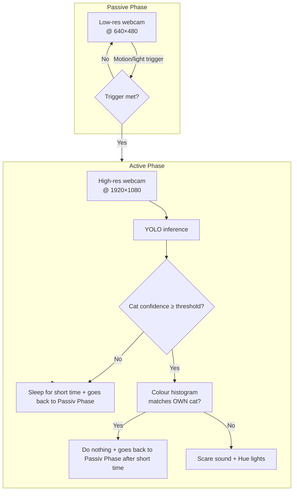

# TheCatBouncer 🐱🚫

> **AI‑powered pet access control** – let your own cat in, keep unwelcome felines out.

    

---

TheCatBouncer is a vision‑based, two‑phase monitoring system that **recognises your own cat by colour & shape and automatically repels intruders** with lights and sound – perfect for cat‑flap cameras, garden doors or patio windows.

---

## Table of Contents

1. [Features](#features)
2. [How It Works](#how-it-works)
3. [Hardware & Software Requirements](#requirements)
4. [Installation](#installation)
5. [Configuration](#configuration)
6. [Running](#running)
7. [CLI Reference](#cli-reference)
8. [Folder Layout](#folder-layout)
9. [Roadmap](#roadmap)
10. [Contributing](#contributing)
11. [License](#license)

---

## Features

| Category                        | Details                                                                                                                             |
| ------------------------------- | ----------------------------------------------------------------------------------------------------------------------------------- |
| **High‑accuracy cat detection** | YOLOv11/yolo11l_openvino models (user‑selectable) with automatic fallback CPU → CUDA → OpenVINO                                     |
| **Owner vs. intruder logic**    | Simple colour‑histogram analysis lets you whitelist your cat with just a few HSV ranges                                             |
| **Two‑phase efficiency**        | Low‑res passive monitoring → High‑res active analysis when motion/light is detected                                                 |
| **Smart‑home integration**      | Native Philips Hue support (lights on/off, colour changes, flash patterns)                                                          |
| **Automatic deterrents**        | Plays custom scare sounds (.wav / .mp3) + light show for unknown cats (pick randome on if more than one file is in the folder)      |
| **Scheduled operation**         | Active hours / quiet hours & daily maintenance cron                                                                                 |
| **Configurable maintenance window** | Backups & storage cleanup run **once per day at a user‑defined **`` after the main loop, ensuring great efficiency                  |
| **Robust NAS backup**           | OS‑aware snapshots via rsync** (Linux/macOS)** or robocopy** (Windows)** with placeholder detection to prevent misconfigurations      |
| **Data management**             | Incremental backups, disk‑space pruning, rolling rotation (auto‑deletes backups older than X days)                                  |
| **Disk‑space watchdog**         | Continuously monitors free space and purges the oldest videos / logs when the threshold is breached                                 |
| **CLI overrides & threaded I/O** | Command‑line flags for live preview & inference device – plus a threaded video stream for <20 ms capture latency                    |
| **Comprehensive logging**       | Multi‑level logging: daily logs, system logs, per‑event YOLO detections with frame snapshots & bounding‑box coordinates              |
| **Cross‑platform**              | Runs on Windows, macOS & Linux; works with any UVC webcam                                                                           |
| **Fully configurable**          | Single config.ini controls everything – no code changes required                                                                    |

---

## How it Works



---

## Requirements

### Hardware

- USB / IP webcam (720p+ recommended)
- **Optional:** Philips Hue bridge + lights
- **Optional:** off-site backups to a NAS (via SMB on Windows or SSH/SCP on Linux/macOS)

### Software

- Python **3.10**
- [Conda ≥ 23] or [Mamba] for environment management
- Dependencies listed in `environment.yml`

---

## Installation

```bash
# 1. Clone the repo
$ git clone https://github.com/JojiAce/TheCatBouncer.git
$ cd TheCatBouncer

# 2. Create environment (recommended)
$ conda env create -f environment.yml
$ conda activate catbouncer-env

# 3. Add your scare sounds
$ mkdir -p cat_scare_sound && cp ~/Downloads/bark.mp3 cat_scare_sound/
```

---

## Configuration

Copy the template and fill in **your** values:

```bash
cp config.sample.ini config.ini
```

```ini
[Zeitsteuerung]
start_zeit = 01:00   # Monitoring starts 1 AM
end_zeit   = 07:00   # Monitoring ends 7 AM

[PhilipsHue]
bridge_ip = YOUR_BRIDGE_IP_HEAR
app_key   = YOUR_APP_KEY_HERE
licht_ids = YOUR_LIGHTS_IDS_HEAR

[Kamera]
kamera_index      = 0
niedrige_aufloesung = 640,480
hohe_aufloesung     = 1920,1080
fps_niedrig = 10
fps_hoch    = 30

[Bilderkennung]
yolo_modell_pfad         = models/yolov11n.pt
katzen_klassen_id        = 15
katzen_sicherheit_schwelle = 0.8

[Farbanalyse]
untere_schwarz_hsv = 0,0,0
obere_schwarz_hsv  = 180,255,50
schwarz_pixel_schwelle = 0.5
```

> **Tip :** Calibrate colour ranges with the built‑in live debug window (`--live-preview`).

---

## Running

```bash
# Basic run (uses config.ini)
python TheCatBouncer.py

# Force live preview window
python TheCatBouncer.py --live-preview

# Override inference device
python TheCatBouncer.py --device cuda:0
```

### CLI Reference

| Flag                                 | Description                       | Default      |
| ------------------------------------ | --------------------------------- | ------------ |
| `--live-preview / --no-live-preview` | Show/hide OpenCV window           | From config  |
| `--device {cpu,cuda:0,gpu}`          | Force inference device            | From config  |

---

## Folder Layout

```
TheCatBouncer/
├── cat_scare_sound/            # Your audio deterrents (*.wav / *.mp3)
├── CatDetectorData/            # Data for cat detection (automatically created)
│   ├── Cat_detection_information_debugging/ # Debugging information for cat detection
│   ├── Cat_detection_information_YOLOv11_debugging/ # Debugging information for YOLOv11 cat detection
│   ├── Systemprotokolle/       # System logs
│   ├── Tagesprotokolle/        # Daily logs
│   └── VideoAufnahmen_Debug/   # Debug video recordings
├── HelpingProgramms/           # Tools for various tasks
│   ├── philips_hue_setup_tool/ # Tool for Philips Hue setup
├── models/                     # YOLO weights (.pt) or OpenVINO (.xml+.bin) - as referenced in config.ini
├── yolo11_openvino_model_paths/ # OpenVINO model paths
├── yolo11_pt_format_model_paths/ # PyTorch format model paths
├── backups/                    # NAS snapshots (optional)
├── TheCatBouncer_sample.py     # Main entry‑point (sample script)
├── config.sample.ini           # Template config – **commit me**
├── environment.yml             # Conda env definition
```

---

## Roadmap

-Not really Sure yet

---

## Contributing

Pull requests are welcome! Please open an issue first to discuss major changes.\
Make sure to run `ruff` and `black` before committing.

---

## License

This project is licensed under the **MIT License** – see the [LICENSE](LICENSE) file for details.

---

