# TheCatBouncer 🐱🚫

> **AI‑powered pet access control** – let your own cat in, keep unwelcome felines out.


---

TheCatBouncer is a vision‑based, two‑phase monitoring system that **recognises your own cat by colour & shape and automatically repels intruders** with lights and sound – perfect for cat‑flap cameras, garden doors or patio windows.

---

## Table of Contents

1. [Features](#features)
2. [How It Works](#how-it-works)
3. [Hardware & Software Requirements](#requirements)
4. [Installation](#installation)
5. [Configuration](#configuration)
6. [Running](#running)
7. [CLI Reference](#cli-reference)
8. [Folder Layout](#folder-layout)
9. [Roadmap](#roadmap)
10. [Contributing](#contributing)
11. [License](#license)

---

## Features

| Category                        | Details                                                                                                                             |
| ------------------------------- | ----------------------------------------------------------------------------------------------------------------------------------- |
| **High‑accuracy cat detection** | YOLO11 and the equivalent openvino models are natively supported (testet on)                                     |
| **Smart hardware backend picker** |Automatically selects the best available backend. Example: If GPU is chosen, it uses CUDA if available, otherwise falls back to OpenVINO GPU/iGPU, or CPU if no GPU is detected.                                  |
| **Owner vs. intruder logic**    | Simple colour‑histogram analysis lets you whitelist your cat with just a few HSV ranges                                             |
| **Two‑phase efficiency**        | Low‑res passive monitoring → High‑res active analysis                                                 |
| **Smart‑home integration**      | Native Philips Hue support (lights on/off, colour changes, flash patterns)                                                          |
| **Automatic deterrents**        | Plays custom scare sounds (.wav / .mp3) + activate lights for unknown cats (it picks one random sound file if more than one file is in the folder)      |
| **Scheduled operation**         | Active hours / quiet hours & daily maintenance cron                                                                                 |
| **Configurable maintenance window** | Backups & storage cleanup run **once per day at a user‑defined **`` after the main loop, ensuring great efficiency                  |
| **Robust NAS backup**           | OS‑aware snapshots via rsync** (Linux/macOS)** or robocopy** (Windows)** with placeholder detection to prevent misconfigurations      |
| **Data management**             | Incremental backups, disk‑space pruning, rolling rotation (auto‑deletes backups older than X days)                                  |
| **Disk‑space watchdog**         | Continuously monitors free space and purges the oldest videos / logs when the threshold is breached                                 |
| **CLI overrides & threaded I/O** | Command‑line flags for live preview & inference device – plus a threaded video stream for <20 ms capture latency                    |
| **Comprehensive logging**       | Multi‑level logging: daily logs, system logs, per‑event YOLO detections with frame snapshots & bounding‑box coordinates              |
| **Live Debug Window**           | For Quick Debugging the Active Phase + FPS counter of the actual prozest frames by the Detection Model in the left upper corner          |
| **Cross‑platform**              | Runs on Windows, macOS & Linux; works with any webcam                                                                           |
| **Fully configurable**          | Single config.ini controls everything – no code changes required                                                                    |

---

## How it Works

```mermaid
flowchart TD
  subgraph Passive[Passive Phase]
    A[Low‑res webcam<br/>@ 640×480] -->|Motion/light trigger| Switch{Trigger met?}
  end
  Switch -->|Yes| Active
  Switch -->|No| A
  subgraph Active[Active Phase]
    B[High‑res webcam<br/>@ 1920×1080] --> C[YOLO inference]
    C --> D{Cat confidence ≥ threshold?}
    D -->|No| EndAll[Sleep for short time + goes back to Passiv Phase]
    D -->|Yes| ColourCheck[Colour histogram<br/>matches OWN cat?]
    ColourCheck -->|Yes| Welcome[Do nothing + goes back to Passiv Phase after short time]
    ColourCheck -->|No| Repel[Scare sound + Hue lights]
  end
  Active --> EndAll
```



---

## Requirements

### Hardware

- webcam (720p+ recommended)
- **Optional:** Philips Hue bridge + lights
- **Optional:** off-site backups to a NAS (via SMB on Windows or SSH/SCP on Linux/macOS)

### Software

- Python **3.10**
- [Conda ≥ 23] for environment management
- Dependencies listed in `environment.yml`

---

## Installation

```bash
# 1. Clone the repo
$ git clone https://github.com/JojiAce/TheCatBouncer.git
$ cd TheCatBouncer

# 2. Create environment (recommended)
$ conda env create -f environment.yml
$ conda activate catbouncer-env

# 3. Create your scare sounds Folder (mp3 and wav are supported audio formats)
$ mkdir -p cat_scare_sound
```

---

## Configuration

Copy the template and fill in **your** values:

```bash
cp config.sample.ini config.ini
```

```ini
[TimeManagement]
# Monitoring schedule (24‑hour format)
start_time            = 18:00   # e.g., 18:00
end_time              = 07:00   # e.g., 07:00
data_management_time  = 07:10   # Daily maintenance window start

[PhilipsHue]
bridge_ip             = YOUR_BRIDGE_IP_HERE
app_key               = YOUR_APP_KEY_HERE
light_ids             = ID1,ID2,ID3   # Comma‑separated Philips Hue light IDs

[Camera]
camera_index          = 0
low_resolution        = 640,480   # Width,Height
high_resolution       = 1920,1080 # Width,Height
fps_low               = 5
fps_high              = 30

[Trigger]
brightness_threshold       = 220    # 0–255
brightness_pixel_percentage = 0.01   # Fraction of pixels (e.g., 0.01 = 1%)

[Paths]
base_storage_path     = CatDetectorData     # Relative to script directory
sound_directory       = cat_scare_sound     # Path for scare sounds

[NAS]
nas_ip                = YOUR_NAS_IP_HERE
nas_user              = YOUR_NAS_USERNAME
nas_destination_path  = /path/to/backup/folder
nas_windows_share     = YOUR_WINDOWS_SHARE_NAME

[ImageRecognition]
yolo_model_path            = yolo11_openvino_model_paths/yolo11s_openvino_model
inference_device           = gpu      # cpu, gpu, or cuda:0
cat_class_id               = 15       # Class ID for "cat"
cat_confidence_threshold   = 0.8      # 0.0–1.0

[ColorAnalysis]
lower_black_hsv            = 0,0,0   # H,S,V for detecting black
upper_black_hsv            = 180,255,60
black_pixel_threshold      = 0.5      # Fraction of pixels

[Actions]
intruder_light_minutes     = 4        # Minutes to keep lights on
show_live_window           = true     # true/false for live debug window

[StorageManagement]
min_free_space_gb          = 10       # Minimum free disk space in GB
max_file_age_days          = 2        # Delete files older than this
```


---

## Running

```bash
# Basic run (uses config.ini)
python TheCatBouncer.py

# Force live preview window
python TheCatBouncer.py --live-preview     # show window
python TheCatBouncer.py --no-live-preview  # hide window

# Override inference device
python TheCatBouncer.py -d cuda:0          # short flag
python TheCatBouncer.py --device cuda:0    # long flag
```

### CLI Reference

| Flag                                   | Description                 | Default     |
| -------------------------------------- | --------------------------- | ----------- |
| `--live-preview / --no-live-preview`   | Show/hide OpenCV window     | From config |
| `-d, --device {cpu,cuda:0,gpu}`        | Force inference device      | From config |

---

## Folder Layout

```
TheCatBouncer/
├── cat_scare_sound/            # Your audio deterrents (*.wav / *.mp3)
├── CatDetectorData/            # Data for cat detection (automatically created)
│   ├── Cat_detection_information_debugging/ # Debugging information for cat detection
│   ├── Cat_detection_information_YOLOv11_debugging/ # Debugging information for YOLOv11 cat detection
│   ├── Systemprotokolle/       # System logs
│   ├── Tagesprotokolle/        # Daily logs
│   └── VideoAufnahmen_Debug/   # Debug video recordings
├── HelpingProgramms/           # Tools for various tasks
│   └── philips_hue_setup_tool/ # Tool for Philips Hue setup
├── models/                     # YOLO weights (.pt) or OpenVINO (.xml+.bin) - as referenced in config.ini
├── yolo11_openvino_model_paths/ # OpenVINO model paths
│   ├── yolo11l_openvino_model    # This one is for large openvino model
│   └── ...                       # One folder for each model size  (if you want)
├── yolo11_pt_format_model_paths/ # PyTorch format model paths
│   ├── yolo11m.pt                # This one is for the m pt model
│   └── ...                       # One folder for each model size (if you want)
├── backups/                    # NAS snapshots (optional)
├── TheCatBouncer_sample.py     # Main entry‑point (sample script)
├── config.sample.ini           # Template config – **commit me**
├── environment.yml             # Conda env definition
```

---

## Roadmap

-Not really Sure yet

---

## Contributing

Pull requests are welcome! Please open an issue first to discuss major changes.\
Make sure to run `ruff` and `black` before committing.

---

## License

This project is licensed under the **MIT License** – see the [LICENSE](LICENSE) file for details.

---

